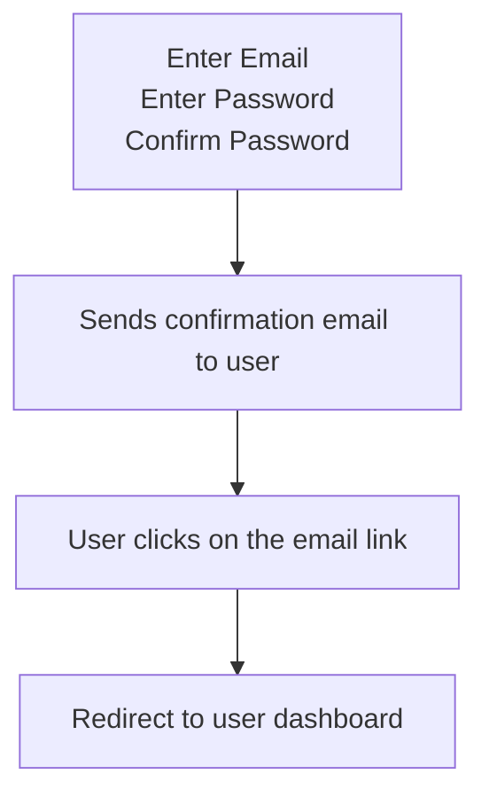
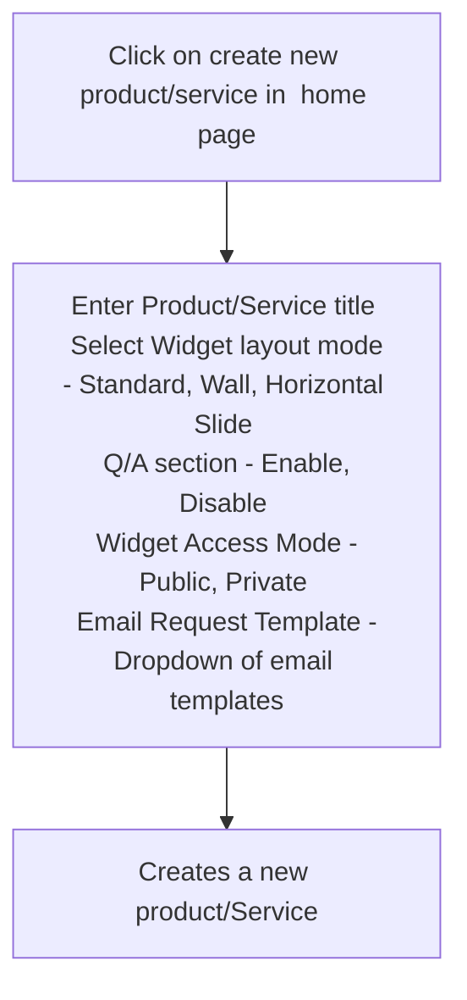
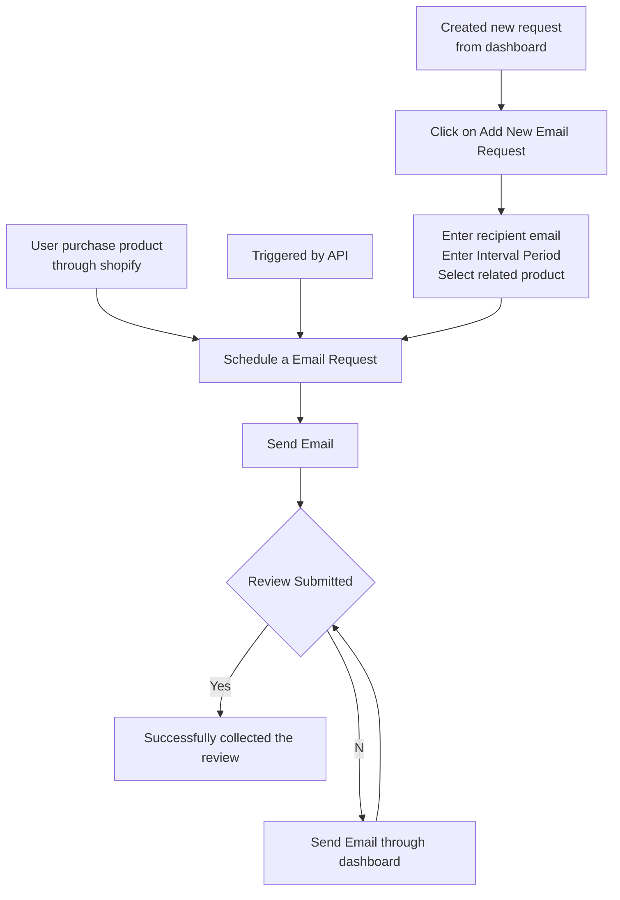
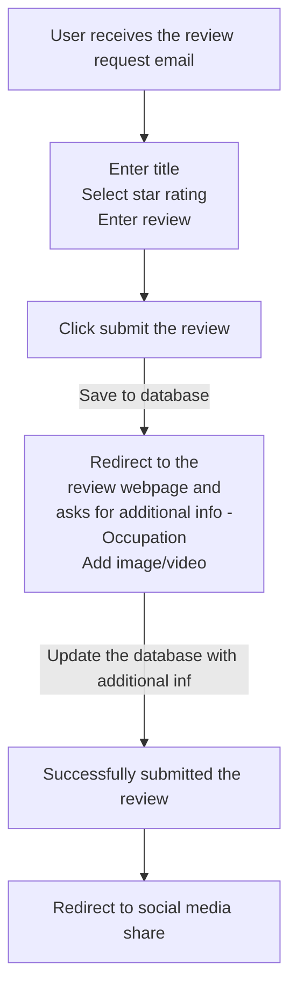
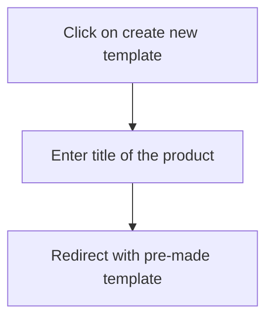

### User Workflows

#### Sign Up Workflow

#### Creating a New Product

**Widget Access Mode**
Ultimately, the decision of whether to allow every visitor to leave a review or only buyers should be based on your specific business needs and goals. If you are looking to drive engagement and increase traffic to your site, allowing every visitor to leave a review may be a good option. If you are more concerned with ensuring the authenticity of your reviews, requiring buyers to leave a review may be the better choice.

**Automatically Post high sentiment & 5 star ratings on social media**
Facebook - https://developers.facebook.com/docs/pages/publishing/
Linkedin - https://learn.microsoft.com/en-us/linkedin/shared/authentication/getting-access?context=linkedin%2Fcontext&view=li-lms-2023-02

#### Email request sending

#### Public / Private review submission

**Redirection webpage**
Redirection webpage depends on users form completion -

First web UI - If user entered all required information then user will be prompted to ask only additional information

Second web UI - If user didn't enter the required information it will prompt UI with all form fields to asking for all information

First UI is specific for email request emails and Second web UI can be also used in link requests

#### Creating new email template

show email template used product names list in the template customize dashboard